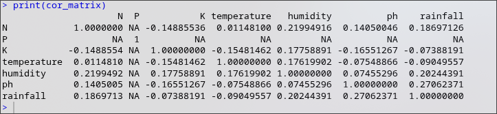
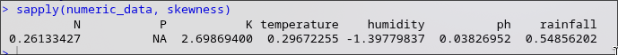

<!-- markdownlint-disable MD013 -->
<!-- markdownlint-disable MD060 -->
# Intelligent-Crop-Recommendation-System

Agriculture plays a vital role in ensuring food security and economic stability.
However, many farmers select crops without proper analysis of soil nutrients and
environmental conditions, which can lead to low productivity and financial losses.
There is a need for a data-driven system that assists
farmers in making informed crop selection decisions.

This project proposes the development of an
**Intelligent Crop Recommendation System (ICRS)** using data mining techniques.
The system will utilize the Crop Recommendation dataset from
[Kaggle](https://www.kaggle.com/datasets/atharvaingle/crop-recommendation-dataset),
which contains information about soil nutrients
(Nitrogen, Phosphorus, Potassium),
temperature, humidity, pH, and rainfall. Data preprocessing techniques such as
cleaning, transformation, and dimensionality reduction will be applied using R.

The expected outcome is a predictive model that accurately recommends suitable
crops based on soil and climatic conditions, along with clustering-based soil
segmentation insights to support better agricultural planning.

## Documentation

### Phase 1

#### Dataset summarization

Adithya created a R code to summarize the dataset and find
the measures of central tendency.

##### Summary


##### Measures of Central Tendency

| Variable     | Mean              | SD                | Variance           | Min           | Max           |
|-------------|-------------------|-------------------|--------------------|--------------|--------------|
| N           | 54.0714812085483  | 34.2535381748454  | 1173.30487749559   | 0            | 140          |
| P           | 51.6859992611747  | 30.2316939862073  | 913.955321275683   | 5            | 145          |
| K           | 46.9764185703758  | 45.6709028167229  | 2085.83136409455   | 5            | 205          |
| temperature | 25.4087930203114  | 4.65873065585056  | 21.7037713237618   | 8.825674745  | 43.67549305  |
| humidity    | 73.3304967246463  | 20.411173048995   | 416.615985236021   | 14.25803981  | 99.98187601  |
| ph          | 6.62921360878224  | 0.800135035040459 | 0.640216074299196  | 3.504752314  | 9.93509073   |
| rainfall    | 131.077906220225  | 75.9322733660625  | 5765.71013853845   | 20.21126747  | 298.5601175  |

##### Correlation Matrix



##### Box-Plots


##### Skewness



#### Missing values & Duplicate handling

Minhaj created a R code to find all the missing values and imputed them with median.

``` txt
========================================
MISSING VALUE ANALYSIS
========================================
Missing values per column:
                 Column Missing_Count Missing_Percentage
N                     N             0               0.00
P                     P             7               0.26
K                     K             0               0.00
temperature temperature             0               0.00
humidity       humidity             0               0.00
ph                   ph             0               0.00
rainfall       rainfall             0               0.00
label             label             0               0.00

Total missing values in dataset: 7 

Handling missing values...
  - Imputed P with median: 50 
```

Minhaj created a R code to detect duplicate values and remove them

``` txt
========================================
DUPLICATE ANALYSIS
========================================
Number of duplicate rows: 507 
Percentage of duplicates: 18.68 %

Removing duplicate rows...
Duplicates removed: 507 
Remaining rows: 2207 
```

#### Outlier Detection and Treatment

Denzel created a R code to find the outliers and treat them.

``` txt
Summary BEFORE removing outliers:
       N                P                K           temperature    
 Min.   :  0.00   Min.   :  5.00   Min.   :  5.00   Min.   : 8.826  
 1st Qu.: 21.00   1st Qu.: 28.00   1st Qu.: 20.00   1st Qu.:22.754  
 Median : 37.00   Median : 51.00   Median : 32.00   Median :25.567  
 Mean   : 50.65   Mean   : 53.35   Mean   : 48.12   Mean   :25.607  
 3rd Qu.: 85.00   3rd Qu.: 68.00   3rd Qu.: 49.00   3rd Qu.:28.559  
 Max.   :140.00   Max.   :145.00   Max.   :205.00   Max.   :43.675  
    humidity           ph           rainfall         label          
 Min.   :14.26   Min.   :3.505   Min.   : 20.21   Length:2207       
 1st Qu.:60.28   1st Qu.:5.972   1st Qu.: 64.58   Class :character  
 Median :80.47   Median :6.425   Median : 95.12   Mode  :character  
 Mean   :71.51   Mean   :6.469   Mean   :103.90                     
 3rd Qu.:89.93   3rd Qu.:6.924   3rd Qu.:124.80                     
 Max.   :99.98   Max.   :9.935   Max.   :298.56                     

Summary AFTER removing outliers:
       N                P               K          temperature   
 Min.   :  0.00   Min.   : 5.00   Min.   : 5.00   Min.   :14.34  
 1st Qu.: 22.00   1st Qu.:25.00   1st Qu.:19.00   1st Qu.:23.42  
 Median : 40.00   Median :45.00   Median :26.00   Median :25.95  
 Mean   : 54.37   Mean   :44.79   Mean   :31.68   Mean   :25.84  
 3rd Qu.: 90.00   3rd Qu.:63.00   3rd Qu.:44.00   3rd Qu.:28.57  
 Max.   :140.00   Max.   :95.00   Max.   :85.00   Max.   :37.13  
    humidity           ph           rainfall         label          
 Min.   :15.82   Min.   :4.546   Min.   : 20.21   Length:1771       
 1st Qu.:58.48   1st Qu.:6.026   1st Qu.: 59.48   Class :character  
 Median :76.86   Median :6.464   Median : 93.79   Mode  :character  
 Mean   :70.22   Mean   :6.481   Mean   : 98.34                     
 3rd Qu.:88.20   3rd Qu.:6.932   3rd Qu.:122.56                     
 Max.   :99.98   Max.   :8.340   Max.   :214.41                     

Outliers removed successfully. Cleaned file saved.
```

Looking at the data closely...

``` txt
-----------------------------------
Column: N 
Lower Bound: -75 
Upper Bound: 181 
No outliers found.

-----------------------------------
Column: P 
Lower Bound: -32 
Upper Bound: 128 
Outliers:
  [1] 130 144 131 140 134 130 145 139 141 138 144 136 136 145 132 133 140 132
 [19] 142 135 139 141 142 129 134 138 131 132 137 136 134 139 138 142 133 139
 [37] 134 140 139 136 139 133 130 135 140 132 132 142 140 133 135 145 136 129
 [55] 130 129 135 132 140 145 139 144 141 138 138 143 142 134 144 129 137 139
 [73] 144 139 133 143 140 137 144 143 140 144 141 144 143 137 144 143 141 142
 [91] 138 137 135 144 133 130 143 143 139 136 131 140 138 145 139 136 138 136
[109] 134 143 145 141 136 136 141 129 138 137 132 139 143 144 143 135 130 142
[127] 129 135 145 131 140 138 140 145 132 137 144 140

-----------------------------------
Column: K 
Lower Bound: -23.5 
Upper Bound: 92.5 
Outliers:
  [1] 195 204 205 196 196 198 197 195 203 204 197 205 201 203 204 195 202 205
 [19] 197 204 201 197 198 201 199 205 203 197 200 197 203 203 198 202 196 201
 [37] 199 204 198 204 201 204 197 195 200 197 200 201 196 203 204 203 195 199
 [55] 202 195 202 195 201 195 203 201 196 205 195 196 199 202 203 199 205 196
 [73] 202 199 199 201 195 201 203 203 205 204 200 203 202 200 199 196 197 197
 [91] 198 203 204 197 204 200 201 202 195 204 196 197 205 201 201 204 205 205
[109] 196 199 197 196 204 199 200 199 198 199 203 195 205 198 196 198 204 203
[127] 197 198 200 198 196 203 197 201 202 195 204 196 202 202 201 196 198 205
[145] 205 199 198 200 204 202 196 202 198 200 199 197 201 204 203 205 195 202
[163] 200 200 196 205 197 200 205 197 204 195 204 195 201 197 200 204 197 203
[181] 204 196 197 203 196 203 205 203 205 201 203 195 198 197 195 197 198 196
[199] 196 197

-----------------------------------
Column: temperature 
Lower Bound: 14.04743 
Upper Bound: 37.26621 
Outliers:
 [1] 37.465668 39.648519 12.141907 12.756796 39.040720 39.707722  9.467960
 [8]  8.825675 11.021054 12.087022 12.800004 38.060995 39.065555 10.898759
[15] 11.797647 11.363009 41.186649 10.380048 10.723025 41.207336 40.660123
[22] 11.827682 13.285043 39.371026 41.656030 41.361063 41.948657 11.189943
[29] 13.058097  9.724458  9.535586 13.429886  9.851243  9.949929 13.360506
[36] 11.503229 12.228162 10.010813 10.786898 11.899257 13.837728 11.547857
[43] 13.703192 13.208444 12.590940 11.866319 11.033679 10.270888 10.356096
[50] 10.164313 11.698946 42.394134 38.419163 42.923253 40.211993 42.134740
[57] 38.441872 39.017933 38.723828 43.302049 40.788818 39.300500 39.731491
[64] 39.233425 40.769987 42.304958 42.846093 43.675493 42.072138 41.419684
[71] 42.547440 43.080227 41.042244 42.933686 43.360515 43.037143 37.462091
[78] 38.732189 38.382315 42.936054 37.588997 40.004391 38.201682 40.102077
[85] 38.589545 41.313301

-----------------------------------
Column: humidity 
Lower Bound: 15.80137 
Upper Bound: 134.4101 
Outliers:
 [1] 15.40590 15.65809 15.40312 15.22539 14.69765 14.71071 15.75594 14.32314
 [9] 15.11280 14.99927 14.42458 14.25804 15.21618 15.77458 14.27328 14.92241
[17] 15.15406 15.48083 14.70086 14.99451 14.72115 14.44228 14.28042 14.44009
[25] 14.76015 14.82633 14.74072 15.57324 15.27824 14.33847 14.77960 15.36144

-----------------------------------
Column: ph 
Lower Bound: 4.543268 
Upper Bound: 8.352081 
Outliers:
 [1] 8.753795 8.718193 8.490127 8.519976 8.829273 8.621663 8.868741 8.766129
 [9] 8.736338 8.380185 8.423874 8.719961 8.861480 3.692864 4.371746 8.399136
[17] 8.840656 9.679241 8.985348 4.524172 9.926212 3.711059 9.254089 3.808429
[25] 4.523636 3.510404 3.828031 8.869533 3.793575 4.193189 9.392695 4.516154
[33] 8.620108 9.459493 9.160692 9.072011 3.504752 8.660780 3.558823 9.416003
[41] 8.923096 8.709292 4.397699 8.532079 3.525366 8.869797 9.406888 8.354958
[49] 8.634930 9.112772 9.935091 8.914075 8.639586 8.621514 3.532009 4.507524
[57] 4.525722

-----------------------------------
Column: rainfall 
Lower Bound: -25.75417 
Upper Bound: 215.1285 
Outliers:
  [1] 226.6555 263.9642 242.8640 262.7173 251.0550 271.3249 241.9742 230.4462
  [9] 251.0550 221.2092 264.6149 250.0832 284.4365 231.0863 284.4365 276.6552
 [17] 224.5550 291.2987 231.3843 233.1076 224.0581 257.0039 271.3586 260.2634
 [25] 240.0811 272.2017 224.6757 270.4417 233.1321 272.2999 285.2494 298.4018
 [33] 257.0344 248.7183 298.5601 265.5356 233.0453 253.7203 219.9048 227.3637
 [41] 286.5084 283.9338 217.3789 267.9762 277.9626 245.1511 245.6627 277.9626
 [49] 279.5452 263.6372 263.6372 243.5120 263.1103 269.5039 260.8875 295.6094
 [57] 257.4915 278.0792 280.4044 223.3672 220.1157 231.7365 242.3171 233.7035
 [65] 230.2242 290.6794 241.2014 218.9164 248.2256 256.9965 295.9249 287.5767
 [73] 243.0745 235.6134 232.7046 238.5009 248.8593 218.2299 246.3613 231.5153
 [81] 218.1421 234.8466 241.8202 240.4796 234.4966 218.0909 240.6864 239.7428
 [89] 224.5904 224.3207 215.9195 218.0056 218.5242 218.0804 224.7007 222.8030
 [97] 224.4017 215.1968 224.8316 225.6324 221.2258
```

Looking at the outliers we find that these outliers should not be removed.
These are not errors, rather they are the requirements of many crops.
If we remove these from our data then it will,

- Remove entire crop categories

- Destroy classification balance

- Bias your ML model

- Reduce accuracy
